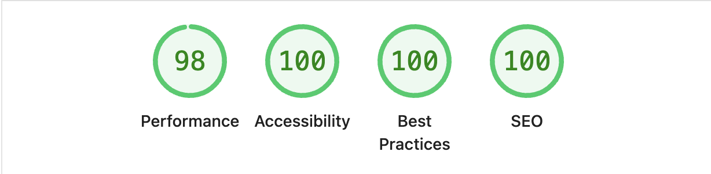
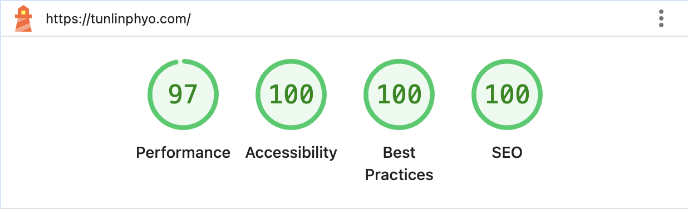

# Portfolio

A creative and interactive portfolio site showcasing personal work and frontend design skills using GSAP, thoughtfully built with accessibility in mind to ensure a smooth and inclusive experience for all users.

---

## 🚀 Live Website

[🔗 View the site](https://tunlinphyo.com/)

---

## ✨ Features

- ⚡ Powered by **GSAP**
- 🎨 Custom design system using CSS theme variables
- 🎹 Full keyboard navigation and shortcut handling
- 🖱️ Cursor and animation effects for immersive interaction
- 🎛️ Integrated with **P5.js** for generative or interactive canvas work
- ☁️ Deployed on **Firebase Hosting**

---

## 🧠 Tech Stack

| Area        | Tools/Technologies                     |
|-------------|----------------------------------------|
| Frontend    | HTML, CSS, TypeScript, GSAP  |
| Animations  | P5.js, Custom CSS animations           |
| Build Tool  | Vite                                   |
| Deployment  | Firebase Hosting                       |
| Styles      | Utility-first custom CSS + Theming     |

---

## 📊 Lighthouse Performance

### 📱 Mobile



### 🖥️ Desktop



> Scores reflect strong performance, accessibility, SEO, and best practices.

---

## 📦 Setup & Development

```bash
# Install dependencies
npm install

# Start development server
npm run dev

# Build for production
npm run build

# Preview production build
npm run preview
```

---

## 🙋‍♂️ About the Author

**Tun Lin Phyo**
Frontend Engineer and system-level UI builder based in Tokyo 🇯🇵.
He specializes in **Web Components**, **custom reactive architectures**, and **performance-first web applications** — all without relying on heavy frameworks.

- 💻 Passionate about UI/UX systems, clean architecture, and modular design
- 🔧 Builds projects with Vite, custom stores, and native browser APIs
- 🌐 [Portfolio Website](https://tunlinphyo.com)

---

## 📝 License

MIT License

---